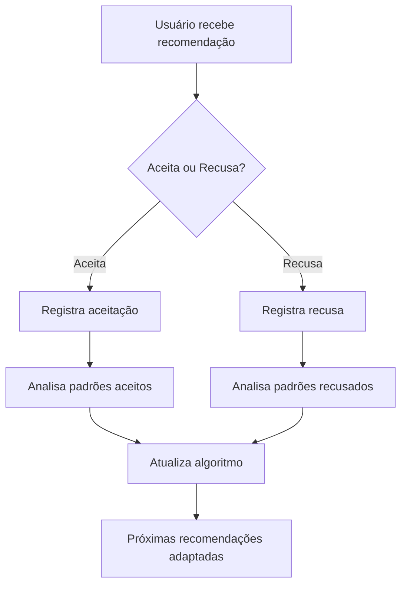

# 📚 Matchbook - Sistema de Recomendação Adaptativa de Livros


## 🎯 Sobre o Projeto

O **Matchbook** é um sistema inteligente de recomendação de livros que utiliza algoritmos adaptativos para sugerir
livros baseados no comportamento e preferências do usuário. O diferencial do sistema está na sua capacidade de \*
\*aprender e se adaptar\*\* conforme o usuário aceita ou recusa recomendações.

## 🧠 Algoritmo de Recomendação Adaptativa

### Como Funciona

O sistema implementa **4 estratégias diferentes** que são aplicadas automaticamente baseadas no histórico de interações
do usuário:

#### 📊 **Estratégias de Recomendação**

| Estratégia        | Condição      | Comportamento                                        |
| ----------------- | ------------- | ---------------------------------------------------- |
| **PADRÃO**        | 0-4 recusas   | Algoritmo original baseado em preferências do perfil |
| **DIVERSIFICADO** | 5-9 recusas   | Mistura preferências com diversidade de gêneros      |
| **EXPLORATÓRIO**  | 10+ recusas   | Recomendações aleatórias para quebrar padrões ruins  |
| **REFINADO**      | 3+ aceitações | Foca nas preferências aprendidas pelo comportamento  |

### 🔄 Processo de Adaptação



### 🎲 Cálculo de Score

O sistema calcula um score para cada livro baseado em:

- **40%** - Compatibilidade com gênero favorito
- **30%** - Compatibilidade com autor preferido
- **30%** - Adequação ao nível de leitura (páginas)
- **+50%** - Boost das preferências aprendidas (algoritmo refinado)

## 🚀 Como Executar

### Pré-requisitos

- Java 17+
- MySQL 8.0+
- Maven 3.8+

### Configuração

1. **Clone o repositório**

   ```bash
   git clone <repository-url>
   cd matchbook
   ```

2. **Configure o banco MySQL**

   ```sql
   CREATE DATABASE matchbook;
   ```

3. **Configure application.properties**

   ```properties
   spring.datasource.url=jdbc:mysql://localhost:3306/matchbook
   spring.datasource.username=root
   spring.datasource.password=sua_senha
   ```

4. **Execute a aplicação**
   ```bash
   ./mvnw spring-boot:run
   ```

A aplicação estará disponível em `http://localhost:8080`

## 📡 API Endpoints

### 🎯 Recomendações

#### `GET /api/recomendacao/getRecomendacao/{idUsuario}`

**Descrição:** Retorna recomendações usando o algoritmo original  
**Parâmetros:** `idUsuario` (Integer) - ID do usuário  
**Resposta:** Lista de livros recomendados

```json
[
  {
    "id": 1,
    "titulo": "1984",
    "autor": "George Orwell",
    "genero": "Ficção Científica",
    "numeroPaginas": 328,
    "disponivel": true
  }
]
```

#### `GET /api/recomendacao/getRecomendacaoAdaptativa/{idUsuario}`

**Descrição:** Retorna recomendações usando algoritmo adaptativo inteligente  
**Parâmetros:** `idUsuario` (Integer) - ID do usuário  
**Resposta:** Lista de livros com recomendações adaptadas ao comportamento

### 📝 Feedback do Usuário

#### `POST /api/recomendacao/recusar`

**Descrição:** Registra que o usuário recusou um livro  
**Parâmetros:**

- `idUsuario` (Integer) - ID do usuário
- `idLivro` (Integer) - ID do livro recusado

**Resposta:**

```json
{
  "totalRecusas": 7,
  "algoritmoAlterado": true,
  "sugestao": "Algoritmo será mais exploratório"
}
```

#### `POST /api/recomendacao/aceitar`

**Descrição:** Registra que o usuário aceitou um livro  
**Parâmetros:**

- `idUsuario` (Integer) - ID do usuário
- `idLivro` (Integer) - ID do livro aceito

**Resposta:** `200 OK`

### 📊 Estatísticas e Análises

#### `GET /api/recomendacao/estatisticas/{idUsuario}`

**Descrição:** Retorna estatísticas detalhadas do usuário  
**Parâmetros:** `idUsuario` (Integer) - ID do usuário

**Resposta:**

```json
{
  "totalRecusas": 7,
  "totalAceites": 3,
  "taxaAceitacao": 30.0,
  "estrategiaAtual": "DIVERSIFICADO"
}
```

### 🔄 Utilitários

#### `POST /api/recomendacao/resetarAlgoritmo/{idUsuario}`

**Descrição:** Reseta todo histórico de recusas e aceitações do usuário  
**Parâmetros:** `idUsuario` (Integer) - ID do usuário  
**Resposta:** `200 OK`

## 🗃️ Estrutura das Tabelas MySQL

### `usuario`

| Campo                 | Tipo         | Descrição                       |
| --------------------- | ------------ | ------------------------------- |
| id                    | INT (PK, AI) | Identificador do usuário        |
| nome                  | VARCHAR(100) | Nome completo                   |
| email                 | VARCHAR(100) | E-mail do usuário               |
| senha                 | VARCHAR(255) | Senha do usuário                |
| data_nascimento       | VARCHAR(50)  | Data de nascimento              |
| genero_favorito       | VARCHAR(50)  | Gênero literário preferido      |
| livros_lidos          | INT          | Quantidade de livros já lidos   |
| autor_preferido       | VARCHAR(100) | Autor preferido                 |
| nivel_leitura         | VARCHAR(50)  | Nível de leitura do usuário     |
| receber_recomendacoes | BOOLEAN      | Se deseja receber recomendações |
| data_cadastro         | Date         | Quando foi cadastrado           |
| fotoUrl               | VARCHAR      | Aleatoria                       |

### `livro`

| Campo          | Tipo         | Descrição               |
| -------------- | ------------ | ----------------------- |
| id             | INT (PK, AI) | Identificador do livro  |
| titulo         | VARCHAR(200) | Título do livro         |
| autor          | VARCHAR(100) | Autor do livro          |
| editora        | VARCHAR(100) | Editora do livro        |
| genero         | VARCHAR(50)  | Gênero do livro         |
| ano_publicacao | INT          | Ano de publicação       |
| numero_paginas | INT          | Número de páginas       |
| idioma         | VARCHAR(50)  | Idioma do livro         |
| isbn           | VARCHAR(20)  | Código ISBN             |
| sinopse        | TEXT         | Sinopse/resumo do livro |
| capa_url       | VARCHAR(500) | URL da imagem da capa   |

### `livro_recusado`

| Campo       | Tipo         | Descrição                 |
| ----------- | ------------ | ------------------------- |
| id          | INT (PK, AI) | Identificador do registro |
| id_usuario  | INT (FK)     | Referência ao usuário     |
| id_livro    | INT (FK)     | Referência ao livro       |
| data_recusa | TIMESTAMP    | Data/hora da recusa       |

### `livro_aceito`

| Campo       | Tipo         | Descrição                 |
| ----------- | ------------ | ------------------------- |
| id          | INT (PK, AI) | Identificador do registro |
| id_usuario  | INT (FK)     | Referência ao usuário     |
| id_livro    | INT (FK)     | Referência ao livro       |
| data_aceite | TIMESTAMP    | Data/hora da aceitação    |

> ⭐ Estas são as tabelas-chave que permitem o aprendizado adaptativo

## 🎯 Fluxo de Uso Típico

### Cenário 1: Usuário Novo

```
1. Usuário faz cadastro com preferências básicas
2. Recebe recomendações baseadas no perfil (PADRÃO)
3. Sistema monitora aceites/recusas
4. Após 3+ aceites → Muda para REFINADO
```

### Cenário 2: Usuário com Muitas Recusas

```
1. Usuário recusa 5+ livros → Algoritmo vira DIVERSIFICADO
2. Sistema oferece variedade maior de gêneros
3. Se continuar recusando (10+) → Vira EXPLORATÓRIO
4. Recomendações ficam mais aleatórias para quebrar padrão
```

### Cenário 3: Reset e Recomeço

```
1. Usuário pode resetar histórico via endpoint
2. Algoritmo volta ao estado PADRÃO
3. Processo de aprendizado recomeça
```

## 🧪 Exemplos de Teste

### Testando Recomendações Adaptativas

```bash
# 1. Obter recomendações iniciais
curl -X GET "http://localhost:8080/api/recomendacao/getRecomendacaoAdaptativa/1"

# 2. Recusar alguns livros
curl -X POST "http://localhost:8080/api/recomendacao/recusar?idUsuario=1&idLivro=5"
curl -X POST "http://localhost:8080/api/recomendacao/recusar?idUsuario=1&idLivro=8"

# 3. Verificar mudanças nas estatísticas
curl -X GET "http://localhost:8080/api/recomendacao/estatisticas/1"

# 4. Obter novas recomendações (agora adaptadas)
curl -X GET "http://localhost:8080/api/recomendacao/getRecomendacaoAdaptativa/1"
```

## 🔧 Tecnologias Utilizadas

- **Spring Boot 3.5.6** - Framework principal
- **Spring Data JPA** - Persistência de dados
- **MySQL** - Banco de dados
- **Maven** - Gerenciamento de dependências
- **Java 17** - Linguagem de programação

## 🎨 Arquitetura

```
📦 matchbook
├── 🎛️ controllers/     # Endpoints REST
├── 🧩 services/        # Lógica de negócio e algoritmos
├── 🗃️ entities/        # Entidades JPA
├── 📊 repositories/    # Acesso a dados
└── ⚙️ configuration/   # Configurações (CORS, etc.)
```

## 🚧 Próximas Melhorias

- [ ] Machine Learning para análise de padrões mais complexos
- [ ] Recomendações baseadas em usuários similares
- [ ] Sistema de tags e categorias mais granular
- [ ] API de avaliações (estrelas) para refinar algoritmo
- [ ] Dashboard analytics para administradores
- [ ] Cache de recomendações para melhor performance

## 📄 Licença

Este projeto está sob a licença MIT. Veja o arquivo `LICENSE` para mais detalhes.

---

## 🤝 Contribuição

Contribuições são bem-vindas! Por favor, abra uma issue primeiro para discutir mudanças maiores.

1. Fork o projeto
2. Crie uma branch para sua feature (`git checkout -b feature/AmazingFeature`)
3. Commit suas mudanças (`git commit -m 'Add some AmazingFeature'`)
4. Push para a branch (`git push origin feature/AmazingFeature`)
5. Abra um Pull Request

---

**Desenvolvido com ❤️ usando Spring Boot**
